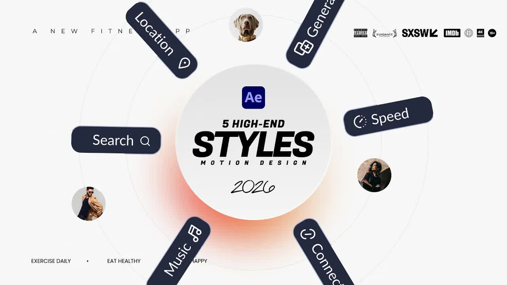

# 5-Trending-Motion-Graphic-Styles-To-Know-in-After-Effects-2026

  <picture>
    
  </picture>

 

---

## Video Information

| Property | Value |
|----------|-------|
| **Video Name** | `5-Trending-Motion-Graphic-Styles-To-Know-in-After-Effects-2026` |
| **Original Link** | [YouTube Video](https://www.youtube.com/watch?v=fB7IGnAPBkA) |
| **Total Size** | **2 parts** - **132.96 MB** |
| **Quality** | **720** |
| **Status** | **Complete (100%)** |
| **Password Protected** | **NO** |

---

## Download Links

> Download **all parts**, then open `5-Trending-Motion-Graphic-Styles-To-Know-in-After-Effects-2026.rar` — the other parts are found automatically.

| # | File | Link |
|---|------|------|
| 1 | `5-Trending-Motion-Graphic-Styles-To-Know-in-After-Effects-2026.part1.rar` | [Download](https://raw.githubusercontent.com/Zagros-hub/Ourtube/main/videos/5-Trending-Motion-Graphic-Styles-To-Know-in-After-Effects-2026/5-Trending-Motion-Graphic-Styles-To-Know-in-After-Effects-2026.part1.rar) |
| 2 | `5-Trending-Motion-Graphic-Styles-To-Know-in-After-Effects-2026.part2.rar` | [Download](https://raw.githubusercontent.com/Zagros-hub/Ourtube/main/videos/5-Trending-Motion-Graphic-Styles-To-Know-in-After-Effects-2026/5-Trending-Motion-Graphic-Styles-To-Know-in-After-Effects-2026.part2.rar) |

---

## How to Extract

| OS | Steps |
|----|-------|
| **Windows** | Double-click `5-Trending-Motion-Graphic-Styles-To-Know-in-After-Effects-2026.rar` — opens in Explorer, WinRAR, or 7-Zip |
| **Mac** | Double-click `5-Trending-Motion-Graphic-Styles-To-Know-in-After-Effects-2026.rar` — extracts with Archive Utility |
| **Linux** | `unzip 5-Trending-Motion-Graphic-Styles-To-Know-in-After-Effects-2026.rar` or right-click → Extract Here |
| **Android** | Tap `5-Trending-Motion-Graphic-Styles-To-Know-in-After-Effects-2026.rar` in file manager or use ZArchiver |

---

*This tool created by [avasam.ir](https://avasam.ir)*
